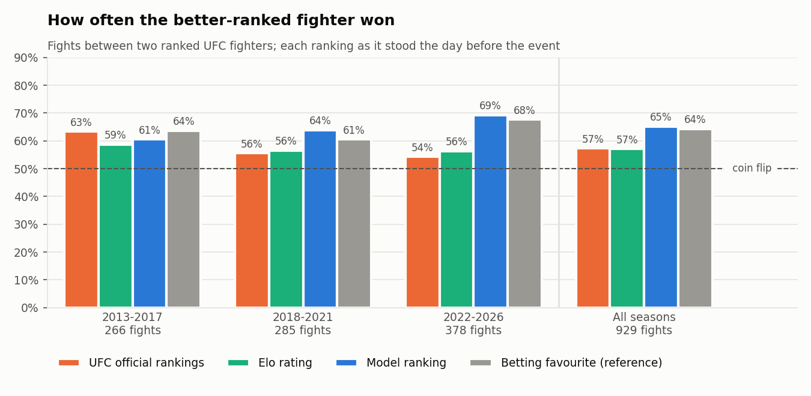

# UFC Fighter Rating

**Ranking UFC fighters with machine learning, and testing the ranking against the official one on real fights.**

[](https://www.python.org/)
[](LICENSE)
[](https://github.com/nadiedjoa-24/Rating-UFC/actions/workflows/ci.yml)

The official UFC rankings are voted by a panel of journalists (and, since June 2026, also computed by a rating model built with Meta). This project builds its own ranking from public data. It collects every UFC fight from UFC 1 (November 1993) to September 2026 from several sources: fight statistics, betting odds, and the official rankings week by week. A fight-outcome model is trained without leaking the future, then used to rank the active fighters of each division: in a virtual round-robin, the model simulates every match-up of the division.

The ranking is then tested where it matters, on the fights between two ranked fighters. **Replayed season by season since 2013, the fighter ranked higher by the model won 65% of these fights, against 57% for the fighter ranked higher by the UFC.**



---

## Results

### Does the ranking predict the fights?

The fights are replayed event by event. The day before each event, the ranking is rebuilt from the fights known at that date, with a model trained on earlier fights only: before each season since 2013, the model is retuned and refitted on the previous seasons. In every fight between two fighters who both held an official rank in the division, each ranking designates a favourite: the better-ranked fighter.

| Every season since 2013 | Favourite won | Picks a different fighter than the UFC rankings | ... and is right |
|---|:---:|:---:|:---:|
| Official UFC rankings (media panel) | 57.3% | | |
| **Model ranking** | **65.1%** | 410 fights | 241 (p < 0.001) |
| Elo rating | 57.1% | 304 fights | 151 (p = 0.95) |
| *Betting favourite, for reference* | *64.3%* | *308 fights* | *190 (p < 0.001)* |

929 fights, 897 of them with odds. The p-value is a sign test on the fights where the two rankings disagree: the chance of a split this uneven if both were equally good.

- **The model ranking is clearly better than the official one** at designating winners, and on par with the bookmakers.
- **Not in every era.** In 2013-2017 the official rankings did slightly better (63% against 61%). Since then they have lost accuracy, down to 54% in 2022-2026, while the model, trained on more fights each season, rose to 69%.
- **The strictest test agrees.** On the test period alone (194 fights from June 2024, with a model trained before it and no design choice made on these fights), the model's favourite won 72.2% of the time and the official one 53.4% (p < 0.001).
- **Limits.** The design choices (features, the choice of a logistic regression, the Elo settings) were made on fights up to 2024, so the earlier seasons are not as strictly out of sample as the test period. The comparison leaves out the 420 fights where our ranking does not rank one of the two fighters in that division (fewer than five UFC fights, a change of division or a layoff of more than two years); the official rankings do no better on them (55%). Details in [notebook 03](notebooks/03_models_and_rankings.ipynb).

### Predicting fights

Test period: the 982 most recent decided fights (June 2024 to September 2026). The models are chosen on the validation period, then refitted on training + validation, and the test period is scored once. Fighter A is drawn at random in each fight, so a coin flip scores 50%.

| Model (fighter statistics only) | Accuracy | AUC | Log loss |
|---|:---:|:---:|:---:|
| **Logistic regression** (selected on validation) | **66.4%** | **0.717** | **0.624** |
| SVM (linear) | 66.2% | 0.717 | 0.623 |
| Random forest | 65.8% | 0.711 | 0.636 |
| XGBoost | 65.3% | 0.709 | 0.632 |
| Elo rating alone | 56.1% | 0.591 | 0.681 |

Against the betting market, on the 911 test fights that have odds:

| Predictor | Accuracy | AUC | Log loss |
|---|:---:|:---:|:---:|
| Betting favourite (market) | 69.9% | 0.758 | 0.586 |
| Logistic regression, statistics only | 66.4% | 0.717 | 0.624 |
| Logistic regression, statistics + odds | 69.8% | 0.759 | 0.586 |

- Public fight statistics predict the winner two times out of three.
- The market remains the reference. Adding the statistics to the odds brings the model level with the bookmakers, not above them: the statistics hold no information the market has not already priced in.
- The statistics-only model is underconfident on the test period (when it gives a fighter 65%, that fighter wins about 73% of the time): its picks and their order are right, its probabilities too cautious ([notebook 03](notebooks/03_models_and_rankings.ipynb)).

### Division rankings (as of 19 September 2026)

Top 3 of the model ranking, among fighters with at least five UFC fights and a fight in the last two years (UFC record in brackets):

| Division | 1 | 2 | 3 |
|---|---|---|---|
| Flyweight | Joshua Van (11-1) | Tatsuro Taira (8-2) | Manel Kape (8-3) |
| Bantamweight | Merab Dvalishvili (14-3) | Umar Nurmagomedov (8-2) | Raul Rosas Jr. (6-1) |
| Featherweight | Movsar Evloev (10-0) | Alexander Volkanovski (15-3) | Aljamain Sterling (18-5) |
| Lightweight | Quillan Salkilld (6-0) | Arman Tsarukyan (11-2) | Ilia Topuria (9-1) |
| Welterweight | Islam Makhachev (18-1) | Michael Morales (7-0) | Shavkat Rakhmonov (7-0) |
| Middleweight | Khamzat Chimaev (9-1) | Dricus Du Plessis (10-1) | Nassourdine Imavov (9-2) |
| Light Heavyweight | Navajo Stirling (6-0) | Magomed Ankalaev (13-2-1) | Carlos Ulberg (10-1) |
| Heavyweight | Jon Jones (22-1) | Ciryl Gane (11-2) | Tom Aspinall (8-1) |
| Women's Strawweight | Tatiana Suarez (9-1) | Fatima Kline (4-1) | Iasmin Lucindo (5-2) |
| Women's Flyweight | Natalia Silva (8-0) | Erin Blanchfield (8-1) | Valentina Shevchenko (15-3-1) |
| Women's Bantamweight | Luana Santos (6-1) | Ailin Perez (6-1) | Jacqueline Cavalcanti (5-1) |

Full top 10 of every division, with each fighter's Elo rating: [UFC_Pipeline.ipynb](UFC_Pipeline.ipynb). Women's featherweight has too few active fighters to be ranked.

The Elo rating is shown next to the ranking as a measure of the record: *who* a fighter beat. It is much closer to the official order than the model is (mean Spearman correlation 0.84 with the media panel and 0.80 with the Meta UFC Rankings, against 0.57 and 0.55 for the model), and it shares the official rankings' weakness at predicting fights. The model ranks prospects with strong profiles higher than their record alone would, and these turn out to be its best calls (see Findings).

## Findings

**The official rankings describe the past.** Over all 1,349 fights between two ranked fighters since 2013, the better-ranked fighter won 64% of the time in 2013-2017 and only 51% in 2022-2026, less often than "the younger fighter wins". Even six places apart, they win just 61% of the time ([notebook 03](notebooks/03_models_and_rankings.ipynb)).

**The model's boldest calls are its best ones.** When a veteran meets a fighter with only five to seven UFC fights, the official rankings favour the veteran 70% of the time, yet the newcomer wins 54% of these fights: a fighter ranked after so few fights is a fast riser. The model favours the newcomer as often as the betting market does, and its favourite wins 69% of these fights, against 57% for the official rankings. Its weak point is the other end: between two veterans it does barely better than the official rankings (60% against 58%), probably because career averages are slow to register a decline ([notebook 03](notebooks/03_models_and_rankings.ipynb)).

**The "red corner" of old fights is the winner.** On ufcstats.com the winner is listed first in every fight before 2010. A model trained on the raw red/blue sides learns "red wins" from the early years. The pipeline draws fighter A at random in each fight (fixed seed), which gives a 50/50 target in every era.

**Career rates computed on a few minutes are noise.** A 20-second knockout debut reads as 15 strikes landed per minute. Every ratio is shrunk towards the UFC average with a prior worth about one average fight.

**A strong feature is not always a useful one.** The share of rounds a fighter has won is, on its own, the most informative feature of all, ahead of Elo. Yet adding the round, judges and bonus features to the model changes its log loss by less than a thousandth in a rolling-origin evaluation: they repeat what career win rates and per-minute statistics already say, so the model does without them ([notebook 02](notebooks/02_feature_engineering.ipynb)).

**Close decisions should count less in Elo.** With K = 80 instead of the textbook 32, and split or majority decisions counting half (the judges themselves disagreed), the Elo-only log loss drops from 0.684 to 0.678 on the fights before the test period, a larger gain than any feature group ([notebook 03](notebooks/03_models_and_rankings.ipynb)).

**Judges do not count strikes.** Since 2010, 21% of decisions went to the fighter who landed fewer significant strikes, and 38% of split decisions ([notebook 01](notebooks/01_exploration.ipynb)).

**Some data would leak the future.** Wikipedia has a page for about 80% of the fighters who debuted in the 2010s but far fewer recent ones: having a page depends on how the career went. The professional records collected from Wikipedia are therefore not used by the models.

## The data

Every UFC fight from UFC 1 to 19 September 2026: **8,905 fights**, **20,904 rounds** with round-by-round statistics, **2,760 fighters** and **427 weekly snapshots** of the official rankings. The raw files are versioned in [`data/raw/`](data/raw/), so every number in this README can be reproduced; `python -m ufc_rating.pipeline` refreshes them from the sources.

| Data | Source | Licence |
|---|---|---|
| Fights, rounds, profiles, judges, bonuses | [ufcstats.com](http://ufcstats.com), via the Kaggle mirror [UFC Datasets 1994-2025](https://www.kaggle.com/datasets/neelagiriaditya/ufc-datasets-1994-2025) and this repository's scraper for the latest events | CC0 (mirror) |
| Odds to March 2026, ranks 2010-2017 | [Ultimate UFC Dataset](https://www.kaggle.com/datasets/mdabbert/ultimate-ufc-dataset) | CC BY 4.0 |
| Odds it misses since 2023, later odds | [bestfightodds.com](https://www.bestfightodds.com) (median over the sportsbooks) | factual data, source credited |
| Official rankings, professional records | [English Wikipedia](https://en.wikipedia.org/wiki/UFC_rankings), through its API | CC BY-SA 4.0 |

How the sources are combined and checked:

- **One key across sources.** Statistics, judges' cards, odds, official rankings and professional records all join on the ufcstats.com ids of fighters, fights and events. Names are matched once, in the pipeline, including name changes and spelling variants (99.9% of ranked names are linked to a fighter; the loosest odds matches were reviewed by hand).
- **Known traps handled.** Before 2010 ufcstats lists the *winner first* in every fight, so its red/blue sides leak the result; draws are not wins; judges' scores are written "loser - winner" and are re-oriented to the two fighters; homonyms are kept apart by id.
- **Checked.** Round-by-round statistics add up to the fight totals for every fight that has both; the parsers are tested on real pages and markup of every source; the latest scraped events were compared field by field with an independent dataset (100% agreement); where two sources give the official rank at fight time, they agree exactly for 82-85% of fighters and within one place for about 90%.

The files in `data/raw/` keep the licences of their sources; the code is under the [MIT License](LICENSE).

## How it works

```
ufcstats.com (Kaggle mirror + scraper) ──┐
betting odds (Kaggle + bestfightodds) ───┼─> master and round tables
Wikipedia (rankings, records) ───────────┘            │
                                                      v
                   fighter states before each date ─> matchups (A vs B) ─> 4 models x 2 feature sets
                                                      │
                   profiles at any date ─> model round-robin (+ Elo) ─> division rankings ─> backtest
```

- **Features without leakage.** For a fight on date *D*, every feature uses only fights on dates strictly before *D*: raw counts are cumulated per fighter, kept once per date and shifted by one date, so even the second bout of a 1990s tournament night does not know the first. `tests/test_features.py` rebuilds the features with the later fights removed and checks that nothing changes.
- **24 differences between fighter A and fighter B**: record (fights, win, finish, KO and submission rates, rate of being finished, recent form, streak, layoff), striking (landed and absorbed per minute, accuracy, defence, knockdowns), grappling (takedowns, accuracy, defence, submission attempts, control time), physical (age, height, reach, stance) and the pre-fight Elo. The "stats + odds" models add the market's log-odds.
- **Models.** A chronological split (70% train, 15% validation, 15% test); logistic regression, SVM, random forest and XGBoost tuned by expanding-window cross-validation on the training period; the validation period picks the model used for the rankings; every model is then refitted on training + validation and the test period is scored once. The logistic regression has no intercept, so P(A beats B) = 1 - P(B beats A) exactly.
- **Rankings.** Active fighters (a fight in the last two years, at least five UFC fights) are ranked in their most recent division by a round-robin in which the model, refitted on every fight, predicts every pair of fighters; a fighter's score is their average win probability. The Elo rating is shown alongside.
- **Backtest.** The rankings are rebuilt the day before every event and compared with the official ranks published before each fight: over the test period with the model trained before it, and over every season since 2013 with the model retuned and refitted before each season (walk-forward).

---

## Installation

```bash
git clone https://github.com/nadiedjoa-24/Rating-UFC.git
cd Rating-UFC
pip install -e ".[notebooks]"
```

Python 3.10 or newer. Development tools: `pip install -e ".[dev,notebooks]"`. Scraper: `pip install -e ".[scrape]"`, then `python -m playwright install chromium`.

## Usage

```bash
python -m ufc_rating.pipeline --offline   # rebuild everything from the versioned data in data/raw
python -m ufc_rating.pipeline             # refresh the sources first
python -m ufc_rating.pipeline --scrape    # also scrape ufcstats.com for events newer than the mirror
```

The refresh downloads the Kaggle sources (with [Kaggle API credentials](https://www.kaggle.com/docs/api)), the Wikipedia rankings and records, and the odds of recent events; a source that cannot be reached is reported and its snapshot is used. The scraper fetches ufcstats.com pages with random pauses between requests, and renders them in a headless Chromium (Playwright) when the site requires a JavaScript-capable client. Wikipedia is read through its public API, and bestfightodds.com one event page at a time with a pause between requests.

The notebooks show every step. [UFC_Pipeline.ipynb](UFC_Pipeline.ipynb) runs the pipeline and writes `data/processed/`, which the three analysis notebooks read: run it first.

| Notebook | Content |
|---|---|
| [UFC_Pipeline](UFC_Pipeline.ipynb) | Runs the pipeline; model scores, division rankings and the ranking backtest |
| [01_exploration](notebooks/01_exploration.ipynb) | Coverage, the corner artefact, how fights end, bonuses, round by round, the judges, data quality, the betting market, official rankings, professional records |
| [02_feature_engineering](notebooks/02_feature_engineering.ipynb) | One career fight by fight, shrinkage, leakage check, signal of each feature, the round/judges/bonus ablation |
| [03_models_and_rankings](notebooks/03_models_and_rankings.ipynb) | Calibration, confidence, coefficients, model vs market, the ranking backtest (test period and every season since 2013), the official rankings since 2013, comparison with both official rankings, Elo tuning, Elo through history |

## Tests

```bash
pytest
```

76 tests cover the parsing of every source (ufcstats.com pages archived by the Wayback Machine, Wikipedia markup of every table layout since 2018, bestfightodds.com pages), the matching of names across sources, the orientation of the judges' scores, the absence of leakage in every feature group, Elo, the exact symmetry of the logistic regression, the ranking rules and the backtest. GitHub Actions runs them on Python 3.10, 3.12 and 3.13, then runs the full pipeline on the versioned data.

## Project structure

```
Rating-UFC/
├── UFC_Pipeline.ipynb            # run the pipeline, see the results
├── notebooks/                    # analysis notebooks (read data/processed/)
├── src/ufc_rating/
│   ├── config.py                 # paths and constants
│   ├── pipeline.py               # end-to-end pipeline and CLI
│   ├── plotting.py               # shared chart style for the notebooks
│   ├── ingest/
│   │   ├── kaggle_sources.py     # Kaggle snapshots
│   │   ├── ufcstats.py           # ufcstats.com scraper (fights, rounds, fighters)
│   │   ├── wikipedia.py          # weekly official rankings, professional records
│   │   └── bestfightodds.py      # closing odds of recent events
│   ├── processing/
│   │   ├── master.py             # master and round tables, odds and rankings matching
│   │   └── features.py           # leakage-free fighter states and matchups
│   ├── models/
│   │   └── training.py           # split, tuning, evaluation, ablation
│   └── ranking/
│       ├── elo.py                # dynamic Elo
│       ├── round_robin.py        # model-simulated round-robin
│       ├── rankings.py           # division rankings, comparison with official ranks
│       └── backtest.py           # rankings replayed against real fights
├── data/
│   ├── raw/                      # versioned source snapshots (19 September 2026)
│   └── processed/                # pipeline outputs (not versioned)
├── tests/                        # pytest suite and archived HTML fixtures
└── pyproject.toml
```

## Limitations

- **The backtest has a trade-off.** The test period is strictly out of sample but short (194 fights); the replay since 2013 is larger (929 fights) but its earlier seasons benefit from design choices made on later data. Both show a clear gap with the official rankings; neither can tell the model and the betting market apart.
- **The model ranks profiles, not opponents.** It rates highly some prospects the UFC has not yet tested against ranked opposition, and a few fighters with an even record but a strong profile. Elo accounts for the opponents, but only through UFC fights.
- **Odds are not complete.** About 94% of the fights since 2010 have closing odds; the gaps are in 2010 and 2023-2024, and bestfightodds.com sometimes lists only part of a card. Market comparisons use only the fights with odds.
- **Official rankings before 2018** only exist at fight time, from the Kaggle odds dataset (2010-2017); the weekly history starts in January 2018.
- **Only UFC fights feed the models.** Debut fights are excluded and newcomers start at Elo 1500; the professional records that would describe them cover notable fighters only (see Findings).
- **Public statistics miss what bookmakers see**: injuries, short-notice replacements, weight cuts, stylistic match-ups. The models do not beat the market and are not meant for betting.
- **Refreshing depends on the sources.** A change in the layout of a source page breaks its parser; the parsers are tested on archived pages so that such a change shows up as a failing test.
